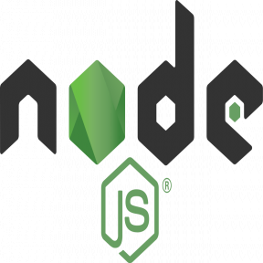

# ---Welcome to Emrah Abdurahman's GitHub Profile :books: :computer: :wink:---

## A Short(ish) Introduction:

```js
console.log("I love Web Design and Web Development!");
```

### Technologies I Am Fluent In:


<br>
<br>

### Technologies I Am Planning to Learn (Or Get More Experience With) in the Future!:




<br>
<br>

Hey, I'm Emrah! I've recently discovered a passion for web technologies. I am on a neverending quest to gain more knowledge, skills,
and experience to level up in this field. Web design and web development allow me to blend an infinite amount of
creativity with logical problem solving. I am using GitHub to document my journey learning web design, development,
and possibly other miscellaneous subjects. I am highly open-minded and would love to work with others on collaboration
projects.

- 👨‍🔬 **Currently working on:**
  - CoolCalc (A personal project on GitHub to independently put into practice some HTML, CSS, and JavaScript)
  - Flourishtry (A fictitious florist website)
- 📚 **Currently learning and practicing:**
  - AJAX
  - Book - JavaScript & JQuery: Interactive Front-End Web Development [Jon Duckett]
  - Course - JavaScript Algorithms and Data Structures - I am completing this course on freeCodeCamp
  - JavaScript
  - jQuery
- :bulb: **Technology List (For my personal reference. It allows me to visualize what to practice with):**
  - AJAX
  - AngularJS
  - AppML
  - ASP
  - Bootstrap
  - C++
  - C#
  - CSS
  - Embedded JavaScript (EJS)
  - Express.js
  - Git
  - GitHub
  - HTML
  - Java
  - JavaScript
  - jQuery
  - JSON
  - Kotlin
  - MongoDB
  - MySQL
  - Node.js
  - npm
  - PHP
  - Python
  - R
  - Raspberry Pi
  - React.js
  - Sass
  - SQL
  - SVG
  - Vue.js
  - XML
  - yarn
