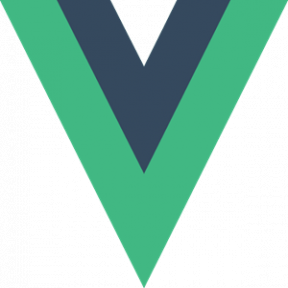

# ---Welcome to Emrah Abdurahman's GitHub Profile :books: :computer: :wink:---

## A Short(ish) Introduction:

```js
console.log("I love Web Design and Web Development!");
```

Hey, I'm Emrah! I've recently discovered a passion for web technologies.

Web design and web development allow me to blend an infinite amount of creativity with logical problem solving. I am on a neverending quest to gain more knowledge, skills, and experience to level up in this field.

I am using GitHub to document my journey learning web design, development, and possibly other miscellaneous subjects.

I am highly open-minded and would love to work with others on collaboration projects.

- 👨‍🔬 **Currently working on:**
  - CoolCalc (A personal project on GitHub to independently put into practice some HTML, CSS, and JavaScript)
  - Flourishtry (A fictitious florist website)
- 📚 **Currently learning and practicing:**
  - **Books:**
    - HTML & CSS: Design and Build Websites [Jon Duckett] - I am rereading this one as a refresher
    - JavaScript & JQuery: Interactive Front-End Web Development [Jon Duckett]
    - The CSS Anthology: 101 Essential Tips, Tricks & Hacks [Rachel Andrew]
  - **Courses:**
    - LinkedIn Learning - Getting Your First Job as a Web Developer
  - **Technologies:**
    - AJAX
    - JavaScript
    - jQuery

### Technologies I'm Well-Versed In:


<br><br>

### Technologies I Look Forward to Learning (Or Getting More Experience With) in the Future!:




